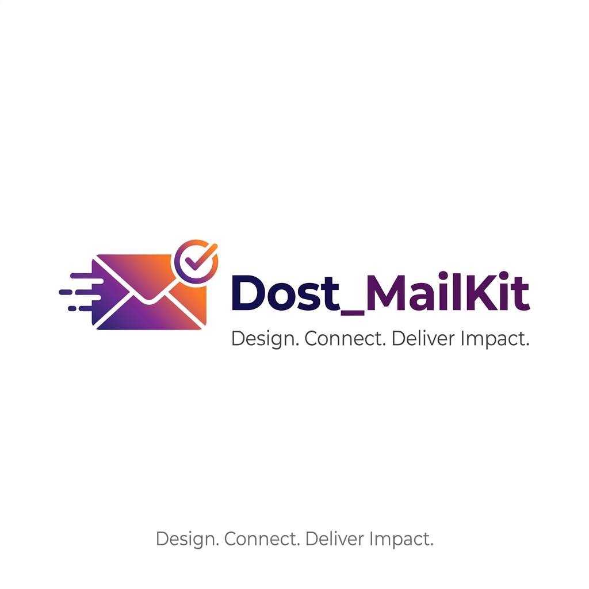

# 📬 Dost_MailKit

<p align="center">
  
</p>

<p align="center">
<b>Build beautiful, responsive email templates visually—with AI.</b><br>
Drag, drop, generate, preview, and export production-ready emails in minutes.
</p>

<p align="center">


</p>

---

## ✨ What is Dost_MailKit?

**Dost_MailKit** is a professional, AI-powered visual email builder designed for marketers, designers, developers, and product teams. 

Forget manually coding complex HTML tables or struggling with rigid, outdated email builders. Dost_MailKit provides an intuitive drag-and-drop interface, a high-fidelity visual inspector, and powerful AI integration to streamline your email production workflow—from ideation to final, production-ready code.

Whether you're crafting newsletters, product launches, event invitations, or transactional emails, Dost_MailKit empowers you to build beautiful, highly compatible emails in record time.

---

# 🎯 Why Dost_MailKit?

Dost_MailKit bridges the gap between design freedom and email compatibility, providing:

- 🎨 **Visual-First Editor**: Intuitive drag-and-drop builder with high-fidelity control over every element.
- 🤖 **AI Design Assistant**: Generate complete, structured email layouts from simple natural language prompts.
- ✍️ **Intelligent Copywriter**: Instantly create subject lines, headlines, and engaging body copy.
- 📱 **Responsive Preview**: Real-time rendering for desktop, tablet, and mobile views.
- 📤 **Clean Code Export**: Generate production-ready, inline-styled HTML, MJML, or high-res PNG snapshots.
- ⚡ **Streamlined Workflow**: Autosave, version history, and global brand management.

---

# 🚀 Key Features

## 🎨 Visual Drag & Drop Builder
Design without writing HTML. Drag, rearrange, resize, and configure everything from typography and spacing to complex multi-column sections and product cards.

## 🖼️ Enhanced Image Tools
Take full control over your images:
- Apply professional CSS filters (grayscale, sepia, contrast, brightness).
- Crop to perfect aspect ratios (16:9, 4:3, 1:1).
- Add interactive hover effects.
- Easily swap assets using the integrated Media Library.

## 💎 Brand Identity & Global Settings
Maintain consistency across all campaigns with global typography controls and a shared brand palette (Primary, Secondary, Accent). Switch seamlessly between design modes to suit your workflow.

## 🤖 AI Layout & Copy Generation
Leverage Google Gemini for rapid ideation:
- **Layout Generator**: Describe your goal and let AI build the structure.
- **Smart Copywriter**: Generate, refine, and iterate marketing copy.
- **Layout Optimizer**: Improve spacing, hierarchy, and visual rhythm instantly.

## 💻 HTML, MJML, & PNG Export
Export clean, inline-styled HTML ready for any ESP (Mailchimp, SendGrid, HubSpot, Brevo, AWS SES).

---

# ⚙️ Tech Stack

### Frontend
- React 19, TypeScript, Vite
- Tailwind CSS v4, Motion (Animations)
- Lucide React (Icons)

### Backend & AI
- Node.js, Express
- Google Gemini API (for AI generation)

---

# 🚀 Getting Started

### Clone & Install
```bash
git clone https://github.com/yourusername/Dost_MailKit.git
cd Dost_MailKit
npm install
```

### Environment Configuration
Create a `.env` file and add your Gemini API key:
```env
GEMINI_API_KEY=your_api_key_here
```

### Run Locally
```bash
npm run dev
```
Access the application at `http://localhost:5173`.

---

# 🔮 Future Roadmap

We have big plans to make Dost_MailKit even more powerful:
- [ ] Gmail integration
- [ ] Direct publishing to Mailchimp/HubSpot/SendGrid
- [ ] Collaborative real-time editing
- [ ] Template & Component marketplace
- [ ] Figma import
- [ ] AI accessibility checker

---

# 🤝 Contributing

Contributions are what make the open-source community such an amazing place to learn, inspire, and create. Any contributions you make are **greatly appreciated**.

### How to Contribute
1. **Fork the Project**
2. **Create your Feature Branch** (`git checkout -b feature/AmazingFeature`)
3. **Commit your Changes** (`git commit -m 'Add some AmazingFeature'`)
4. **Push to the Branch** (`git push origin feature/AmazingFeature`)
5. **Open a Pull Request**

### Areas for Improvement
- **Bug Reporting**: If you find a bug, please open an issue.
- **Templates**: Design new starter templates for different use cases.
- **AI Workflows**: Experiment with new prompt engineering for layout/copy.
- **Accessibility**: Improve generated HTML accessibility.
- **Documentation**: Help us make this README even better!

---

# 📜 License
Distributed under the MIT License. See `LICENSE` for more information.

---

# 👨‍💻 Created by

### Dostam 

Building AI-powered tools that help people create faster, better, and smarter.

<p align="center">
<b>Design beautifully.</b><br>
<b>Write less code.</b><br>
<b>Let AI do the heavy lifting.</b>

🚀 **Dost_MailKit**
</p>
